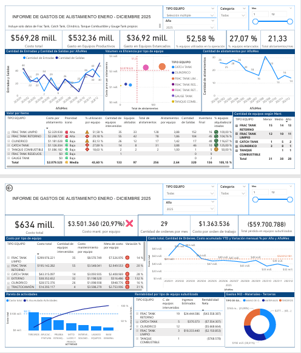

# Análisis de costos y eficiencia operativa en mantenimiento de equipos petroleros

Dashboard desarrollado para analizar los costos asociados al proceso de alistamiento de equipos utilizados en operaciones petroleras.

## Vista del dashboard



## Descripción del proyecto

Este proyecto analiza los costos asociados al proceso de alistamiento y mantenimiento de equipos utilizados en operaciones petroleras.

El objetivo del análisis es proporcionar visibilidad sobre:

- Costos de mantenimiento por tipo de equipo
- Eficiencia operativa del proceso de alistamiento
- Equipos subutilizados o estancados
- Actividades de mantenimiento que generan mayor gasto

Para lograrlo se desarrolló un dashboard interactivo que permite monitorear los indicadores clave del proceso de mantenimiento.

---

## Problema de negocio

La empresa no contaba con una herramienta que permitiera analizar de forma integrada:

- el costo de alistamiento de los equipos
- la eficiencia del proceso de mantenimiento
- la utilización del inventario de equipos
- las actividades que generan mayor impacto en los costos

Esto dificultaba la toma de decisiones para optimizar la operación y controlar los gastos asociados al mantenimiento.

---

## Metodología

El análisis consistió en:

1. Consolidación y limpieza de datos provenientes de órdenes de trabajo.
2. Cálculo de indicadores operativos y financieros.
3. Análisis de costos por tipo de equipo.
4. Identificación de actividades de mantenimiento con mayor impacto en el gasto.
5. Desarrollo de un dashboard interactivo para la visualización de resultados.

---

## Herramientas utilizadas

- Excel
- Power BI

---

## Dashboard

El dashboard permite analizar:

- costo total de alistamiento
- costo promedio por orden de trabajo
- cantidad de alistamientos por mes
- costo por tipo de equipo
- volumen de mantenimiento por equipo
- actividades que generan mayor costo (análisis tipo Pareto)
- equipos subutilizados


---

## Hallazgos principales

El análisis permitió identificar que:

- Un pequeño número de actividades concentra la mayor parte del costo total de mantenimiento.
- Algunos tipos de equipos presentan costos promedio significativamente superiores al resto.
- Existe un porcentaje relevante de equipos subutilizados, lo que reduce la eficiencia operativa.
- La baja rotación de ciertos equipos tiene un impacto directo en la rentabilidad del inventario.

---

## Resultados del análisis operativo

Durante el periodo analizado se registraron **133 equipos intervenidos** dentro del proceso de mantenimiento.

De estos:

- **97 equipos lograron completarse y quedar en estado alistado**
- **36 equipos permanecieron estancados dentro del proceso**

Esto representa aproximadamente **un 27% de equipos estancados**, lo que evidencia oportunidades de mejora en la eficiencia del proceso de mantenimiento.

### Rotación de equipos

En total se registraron **256 alistamientos durante el año**, correspondientes a **97 equipos distintos**.

Esto implica que, en promedio, **cada equipo alistado pasó por mantenimiento aproximadamente 2.6 veces durante el año**.

Los equipos que presentaron **mayor rotación de alistamientos** fueron:

- **Frac Tank Limpio**
- **Catch Tank**

Esto sugiere que estos equipos tienen **mayor utilización operativa dentro de la flota**, requiriendo intervenciones más frecuentes para mantenerse disponibles para alquiler.

### Equipos estancados

El análisis muestra que **36 equipos intervenidos no alcanzaron el estado final de alistado**, generando costos de mantenimiento sin traducirse inmediatamente en disponibilidad operativa.

Reducir este porcentaje representa una oportunidad para:

- mejorar la eficiencia del proceso de mantenimiento
- aumentar la disponibilidad de equipos
- optimizar el uso de los recursos de mantenimiento

---

## Recomendaciones operativas

A partir del análisis de los costos y la utilización de los equipos, se identificaron oportunidades de mejora para el año 2026:

**Optimización del uso de pintura**

La aplicación de pintura representa una actividad con un peso significativo dentro de los costos de mantenimiento.  
Se recomienda evaluar el uso de **recubrimientos internos de mayor durabilidad**, lo cual podría reducir la frecuencia de intervención anual y generar **ahorros estimados de hasta 77 millones de pesos anuales**.

**Reducción de equipos estancados**

Se recomienda monitorear de manera continua los equipos que permanecen en estado de intervención sin llegar a alistarse.  
Reducir este porcentaje permitiría disminuir costos improductivos, con un potencial ahorro estimado de **37 millones de pesos anuales**.

**Optimización de la flota de Frac Tank Retorno**

Dentro de los equipos subutilizados, el **Frac Tank Retorno representa más del 70% de la pérdida total identificada**.

Se sugieren dos alternativas:

- buscar proyectos que incrementen su utilización y generen mayores ingresos
- optimizar el tamaño de la flota reduciendo equipos con baja rotación

Una estrategia conservadora de optimización podría generar **ahorros cercanos a 44 millones de pesos anuales**, mejorar la rotación de equipos y reducir costos operativos en aproximadamente **7%**.

---

## Impacto del proyecto

El dashboard permite:

- mejorar la visibilidad de los costos operativos
- identificar oportunidades de optimización en el mantenimiento
- monitorear la utilización del inventario de equipos
- facilitar la toma de decisiones basadas en datos

---

## Estructura del repositorio

```
analisis-costos-mantenimiento-equipos
│
├── dashboard
│   └── alquiser_dashboard.pbix
│
├── images
│   └── dashboard_preview.png
│
└── README.md
```

---

## Autor

David Torres Quintero
